<div align="center">


# GitSense

### GitHub-native operational intelligence for engineering teams.

Cycle time, contributor signal, and workflow bottlenecks — measured directly
from the repositories you already trust. Calm operational dashboards backed
by a cinematic, restrained marketing experience.

</div>

---

## What GitSense is

GitSense reads the repositories you sync and produces a small set of
**grounded operational signals** that describe the health of your
workspace right now:

- where backlog pressure is concentrating
- which issues have gone quiet
- how contributor load is distributed
- how throughput is trending
- which signals are recurring across cycles

A short AI briefing interprets those deterministic signals into 3–5
sentences of restrained, engineering-focused prose. **The AI does not
invent metrics.** Every number on screen, and every signal cited in
the briefing, traces back to data the deterministic engine actually
computed from your repository.

If the AI provider is unavailable, GitSense falls back to a
deterministic summarizer so the dashboard always renders.

---

## Design philosophy

GitSense runs **two motion cultures** in one product:

| Surface | Culture | Engine |
| --- | --- | --- |
| Landing, marketing, auth brand panel | Cinematic, layered, choreographed | CSS + IntersectionObserver + Lenis (segment-scoped) |
| Dashboards, analytics, repositories, settings | Calm, dense, operational | CSS + IntersectionObserver only |

ESLint enforces this at build time — Lenis and Framer Motion are
forbidden from any operational route chunk. Bundle audits confirm the
isolation holds.

The visual system is:

- **GitHub-blue accent** (`oklch(0.62 0.16 250)` ≈ `#2F81F7`) on a deep
  navy canvas, single saturated CTA per viewport
- **Linear-tight density** in dashboards (13/14 px base, 28 px tabular
  metric values, 32 px row heights)
- **Restrained typography** — two display sizes carry the entire hierarchy
- **Transform + opacity only** for every animation; `prefers-reduced-motion`
  collapses everything to 120 ms opacity fades

---

## Screenshots

### Landing — cinematic hero

The hero choreographs per-word reveal, an animated commit-graph SVG,
and a glowing primary CTA, layered on a page-wide atmospheric
aurora + grid + constellation field.


### Landing — live dashboard showcase

A scroll-pinned section where a stylized dashboard mock tilts, illuminates,
and reveals its panels as the user scrolls past.

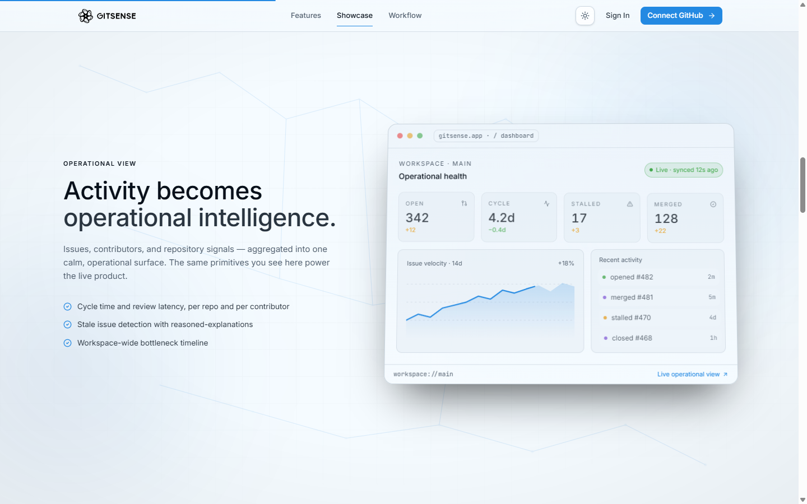

### Landing — workflow scrub

A sticky 5-step storytelling diagram. A glowing data packet slides along the
backbone while step copy crossfades — driven by a single scroll progress
variable, no Framer Motion.

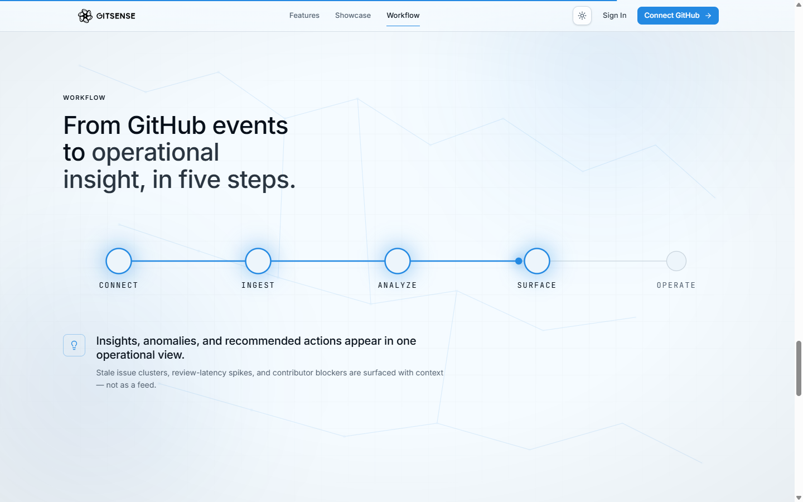

### Dashboard — operational view

The dashboard leads with workspace mode, briefing, and health, then
layers metrics, insights, timeline, heatmap, charts, and the issues feed
underneath. Linear-tight density with calm motion.

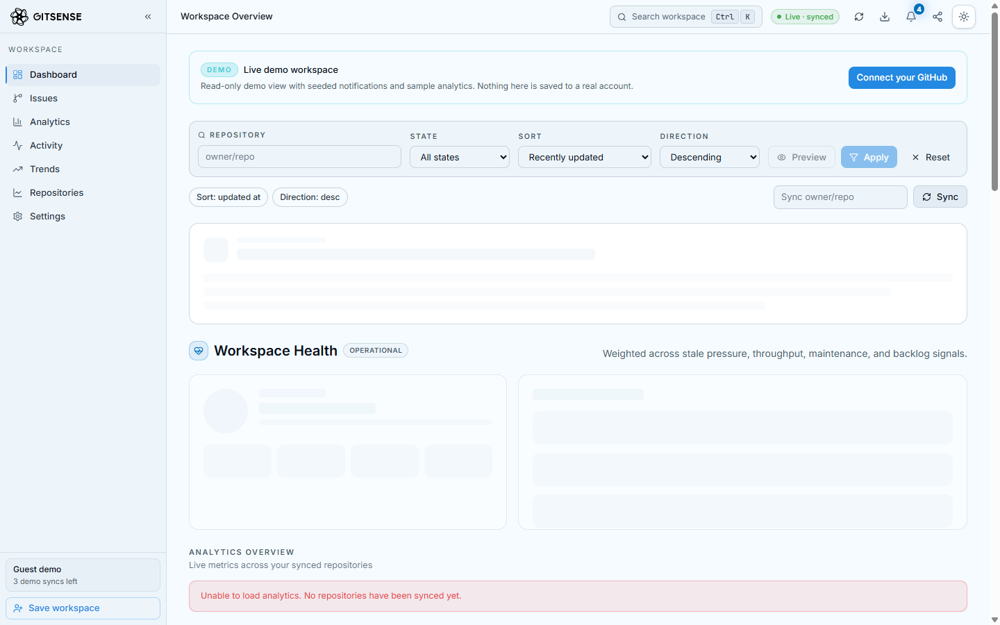

### Dashboard — metrics grid

Tabular-numeric metric values (28 px medium), 11 px uppercase eyebrows,
GitHub-blue chip iconography, and blue → cyan sparklines.

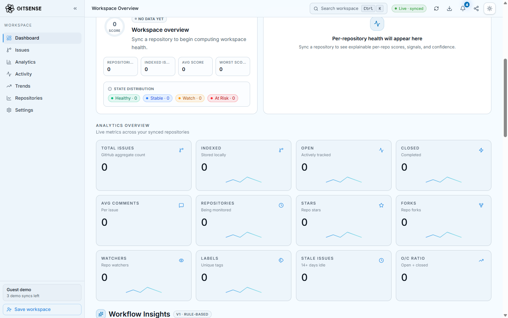

### Dashboard — charts

Recharts re-skinned to the GitSense token system: calm axes (no axisLine,
no tickLine), Level-2 tooltips, accent-blue closed-issue series,
state-open green, accent-cyan label bars.

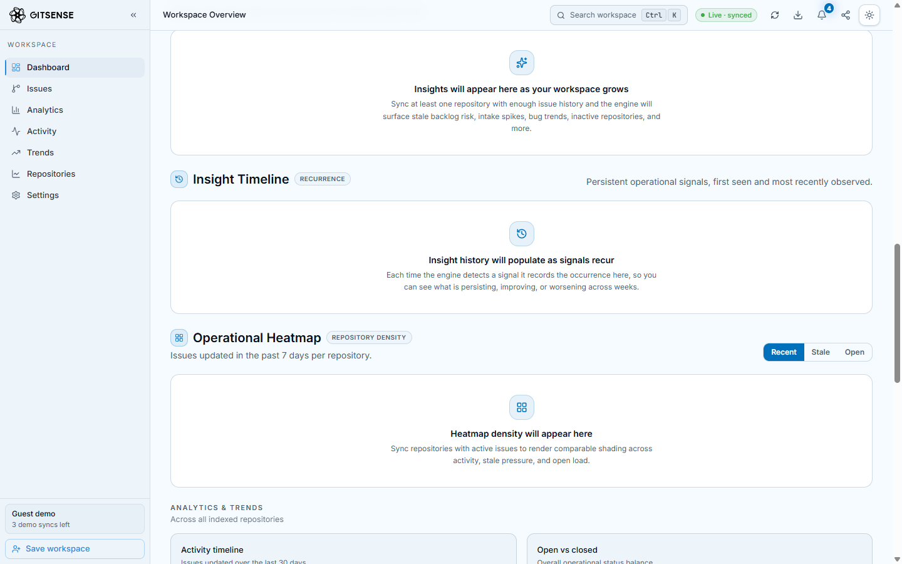

### Issues feed — Linear-tight

GitHub-native state glyphs (open circle / merged check), inline label
badges, dense 12 px meta line with relative age, hover-row interaction.


### Authentication — split-screen

Auth inherits the muted atmospheric layer. The left panel carries brand
identity and the three product pillars; the form column stays calm with
a single glowing GitHub OAuth CTA.

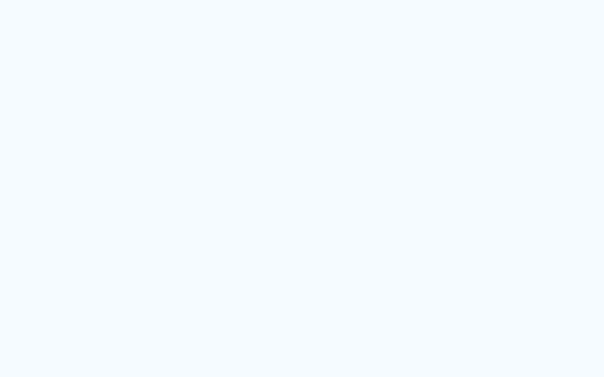

### Dashboard — mobile

Mobile keeps the same operational hierarchy with comfortable touch
targets, an off-canvas sidebar sheet with body scroll-lock, and no
horizontal overflow. The topbar compresses to short title + live
status dot + three essential actions; Export and Share collapse into
the (sm+) action cluster.

<p>
  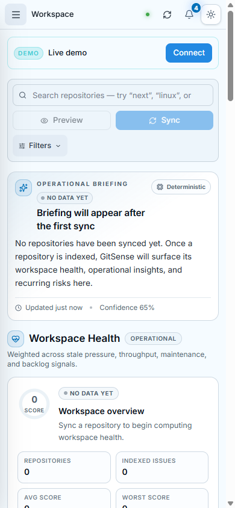
</p>

### Dashboard — mobile metrics grid

MetricsGrid renders as a 2-column compact layout even at 393 px wide.
Values stay at tabular numerics, sparklines remain blue → cyan, the
"Pending changes" FilterBar chip and button row tighten into a 2 ×
grid.

<p>
  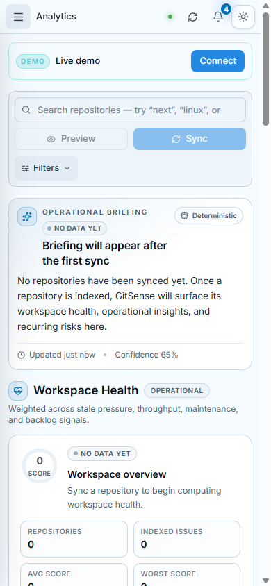
</p>

### Issues — mobile

Issue rows are touch-safe (12 px vertical padding), labels limit to
two with a "+N" overflow indicator, and the comments count joins the
meta line on mobile so the title gets full width.

<p>
  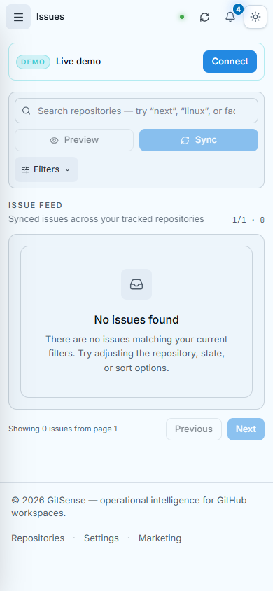
</p>

---

## Key capabilities

| Capability                          | Source                                                                                  |
| ----------------------------------- | --------------------------------------------------------------------------------------- |
| **Operational briefing**            | Deterministic signal bundle, interpreted by a grounded LLM (or deterministic fallback). |
| **Workspace health score**          | Weighted, explainable, per-repository + workspace-level.                                |
| **Backlog & stale-issue pressure**  | Issue age distribution, 14-day idle threshold, per-repo and per-workspace.              |
| **Throughput trend**                | Open vs closed velocity across a configurable window.                                   |
| **Contributor concentration**       | Activity share by contributor across synced repositories.                               |
| **Insight history**                 | Severity-trend tracking (improving / worsening / unchanged) across cycles.              |
| **Activity heatmap**                | Repository-level activity / stale / load intensities.                                   |
| **Export (CSV / JSON / Markdown)**  | Sanitized, formula-injection-safe; Markdown export is executive-ready.                  |
| **Notifications**                   | Operational events (sync completed, stale warnings, AI insight generated, ...).         |
| **Guest workspaces**                | Read-only demo sessions with strict per-session repository limits.                      |
| **GitHub / Google OAuth + email**   | Persistent workspaces are owned by authenticated users.                                 |

---

## Frontend motion system

GitSense ships a small, self-contained motion library. Every primitive is
GPU-friendly (`transform`, `opacity` only) and honors
`prefers-reduced-motion`.

| Primitive | Purpose |
| --- | --- |
| `<Reveal>` | Single-element IntersectionObserver reveal (opacity + translateY). |
| `<RevealGroup>` | Stagger direct children using a CSS custom-property index. |
| `<WordReveal>` | Per-word headline reveal; words remain selectable. |
| `<Counter>` | rAF-driven numeric ramp; honors reduced-motion. |
| `<Shimmer>` | Canonical skeleton primitive. |
| `<Marquee>` | CSS-only horizontal scroller, edge-masked, reduced-motion safe. |
| `<ScrollProgress>` | 2 px top-of-viewport progress bar (transform-only). |
| `<RouteFade>` | 180 ms opacity cross-fade on path change. |
| `<MagneticTarget>` | Cursor-attracted CTA (marketing only; touch + reduced-motion safe). |
| `<LenisProvider>` | Smooth scroll, dynamic-imported, segment-scoped. |
| `<AtmosphericLayer>` | Aurora + grid + constellation + scanline + vignette. |

The reusable UI primitives — `Button`, `Card` / `PanelHeader`, `Surface`,
`Badge`, `Tag`, `Stack`, `Divider`, `Eyebrow`, `Kbd` — consume a single
token system (`--gs-*` CSS custom properties) so dashboards and marketing
share one language without sharing motion intensity.

---

## Architecture

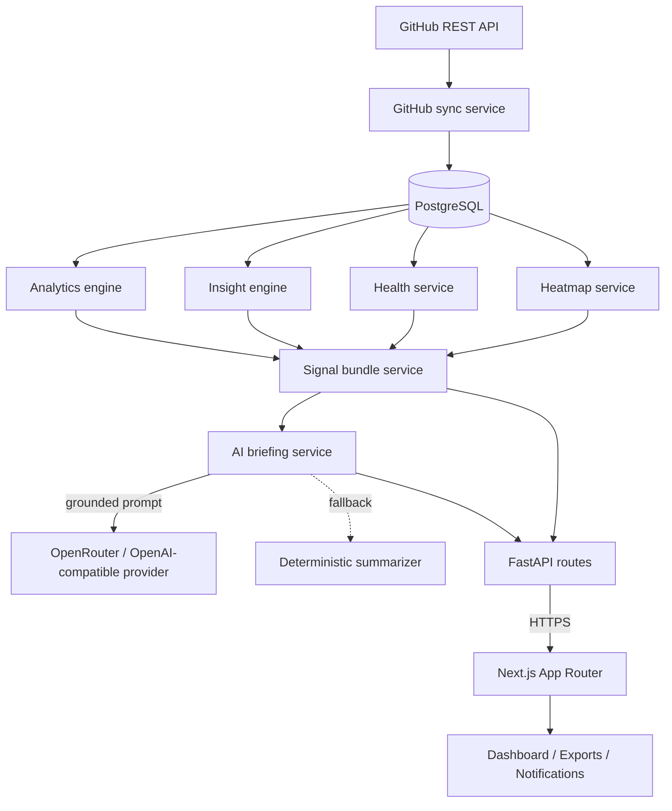

### Request lifecycle (briefing)

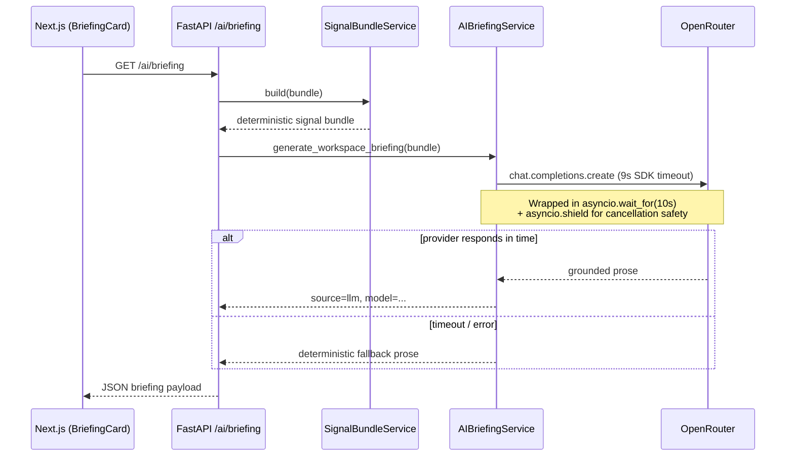

---

## AI philosophy

GitSense treats the LLM as an **interpretation layer**, never as a
data source. The contract:

1. **Grounding.** The system prompt and the user prompt both contain
   the deterministic signal bundle as JSON. The LLM is instructed
   to reference only signals present in that bundle.
2. **No fabrication.** The prompt forbids inventing metrics,
   percentages, dates, repositories, or causes. Language is
   restricted to observational engineering tone (`persisting`,
   `concentrated in`, `has not improved`).
3. **Bounded length.** 3–5 sentences. No lists, headers, emojis,
   marketing language, or rhetorical questions.
4. **Provider isolation.** Every call is wrapped in a hard
   `asyncio.wait_for(10s)` boundary on top of a 9s SDK timeout,
   shielded via `asyncio.shield`, with bounded cancellation drain.
5. **Graceful degradation.** Any error, timeout, or empty workspace
   short-circuits to a deterministic summarizer. The dashboard
   never blocks waiting on an LLM.
6. **Cache.** A 90-second process-local cache prevents repeat
   provider calls during dashboard re-renders.

The result: even if OpenRouter rate-limits or stalls, the
dashboard renders an honest operational summary in a few
milliseconds.

---

## Tech stack

**Frontend**

| Layer        | Choice                                |
| ------------ | ------------------------------------- |
| Framework    | Next.js 16 (App Router)               |
| Language     | TypeScript                            |
| Styling      | Tailwind CSS 4 + OKLCH token system   |
| Type         | Inter (UI) + JetBrains Mono (code/SHAs) via `next/font` |
| Icons        | lucide-react                          |
| Charts       | recharts                              |
| Smooth scroll| Lenis (marketing + auth segments only) |
| Analytics    | `@vercel/analytics` (production only) |

**Backend**

| Layer        | Choice                                |
| ------------ | ------------------------------------- |
| Framework    | FastAPI                               |
| ORM          | SQLAlchemy (async)                    |
| HTTP client  | httpx (AsyncClient, timeouts)         |
| Database     | PostgreSQL                            |
| AI provider  | OpenAI SDK pointed at OpenRouter      |
| Auth         | Email + password, GitHub & Google OAuth |
| Email        | Resend (optional)                     |

**Deployment-ready**

- Frontend: Vercel (Next.js native)
- Backend: any container host (Render / Railway / Fly.io / Docker)
- Database: Supabase / Neon / managed Postgres

---

## Local development

### Backend

```bash
cd backend
python -m venv venv
. venv/Scripts/activate          # Windows
# source venv/bin/activate       # macOS / Linux
pip install -r requirements.txt
cp .env.example .env             # then fill the required keys
uvicorn app.main:app --reload
```

Backend listens on `http://localhost:8000`.
Health check: `GET /health` → `{"status":"healthy"}`.

### Frontend

```bash
cd frontend
npm install
echo "NEXT_PUBLIC_API_BASE_URL=http://localhost:8000" > .env.local
npm run dev
```

Frontend runs at `http://localhost:3000`. The Next.js dev indicator
is intentionally disabled so demo screenshots stay clean.

### Validation

```bash
# Backend
python -m py_compile backend/app/main.py

# Frontend
cd frontend
npm run lint
npm run build
```

All commands should exit with status 0 and zero warnings.

---

## Environment variables

The minimum required for local development is in
[`backend/.env.example`](backend/.env.example). Summary:

| Variable                       | Required | Purpose                                |
| ------------------------------ | -------- | -------------------------------------- |
| `DATABASE_URL`                 | ✅       | PostgreSQL connection string           |
| `JWT_SECRET_KEY`               | ✅       | Session signing                        |
| `GITHUB_CLIENT_ID` / `_SECRET` | ⚠️       | GitHub OAuth (sign-in)                 |
| `GITHUB_TOKEN`                 | ⚠️       | Higher GitHub API rate limit           |
| `GOOGLE_CLIENT_ID` / `_SECRET` | optional | Google OAuth                           |
| `RESEND_API_KEY`               | optional | Verification + password reset emails   |
| `OPENROUTER_API_KEY`           | optional | LLM briefing (falls back when empty)   |
| `OPENROUTER_MODEL`             | optional | Defaults to `deepseek/deepseek-v4-flash:free` |

Frontend reads `NEXT_PUBLIC_API_BASE_URL` and the optional
`NEXT_PUBLIC_SITE_URL` (used by `metadataBase` for absolute
OG / Twitter image URLs).

---

## Repository layout

```
GitSense/
├── AGENTS.md                  # Global engineering rules
├── README.md                  # This file
├── report.txt                 # Implementation report
├── docs/
│   ├── DEPLOYMENT.md          # Deployment recipe
│   └── screenshots/           # Real screenshots used in README
├── .github/
│   ├── ISSUE_TEMPLATE/        # Bug + feature request templates
│   └── PULL_REQUEST_TEMPLATE.md
├── CONTRIBUTING.md
├── backend/
│   ├── AGENTS.md              # Backend rules
│   ├── .env.example
│   ├── requirements.txt
│   └── app/
│       ├── api/               # Route handlers (thin)
│       ├── services/          # Business logic
│       ├── models/            # SQLAlchemy models
│       ├── schemas/           # Pydantic schemas
│       ├── database/          # DB setup / session
│       ├── utils/             # Shared helpers
│       └── main.py
└── frontend/
    ├── AGENTS.md              # Frontend rules
    ├── package.json
    ├── public/                # Branding assets
    └── src/
        ├── app/               # App Router routes
        │   ├── (auth)/        # Auth segment (Lenis allowed)
        │   ├── (app)/         # Operational segment (Lenis forbidden)
        │   └── page.tsx       # Landing (Lenis allowed)
        ├── components/
        │   ├── motion/        # CSS+IO motion primitives
        │   ├── primitives/    # UI primitives
        │   ├── landing/       # Marketing sections
        │   ├── dashboard/     # Operational panels
        │   ├── auth/          # Auth forms
        │   └── layout/        # Shells (AppShell, AuthSplitLayout)
        ├── hooks/
        └── lib/               # API helpers, sanitization
```

---

## Operational philosophy

- **Deterministic first, AI second.** Every signal is computable
  without the LLM. AI is presentation, not analysis.
- **Bounded everything.** Provider calls have hard timeouts.
  Caches have TTLs. Inputs are pagination-bounded.
- **No fake live streaming.** No fabricated metrics, no synthetic
  contributor counts, no animated noise.
- **Ownership-scoped data.** Authenticated workspaces are
  persistent and isolated. Guest sessions are temporary with
  strict limits.
- **Honest empty states.** When there is nothing to say, GitSense
  says so — it does not pad output to look busy.
- **Sanitized exports.** CSV cells are formula-injection-safe;
  Markdown exports escape user-controlled strings.
- **Bundle isolation.** Lenis and Framer Motion are forbidden from
  every operational chunk — enforced by an ESLint
  `no-restricted-imports` rule and verified by bundle audit.

---

## Roadmap (non-binding)

- Shared cross-worker briefing cache (Redis) for multi-instance
  deployments.
- Server-side PDF export (currently disabled in the export panel).
- Per-team workspaces with role-based access.
- Configurable insight thresholds (currently hard-coded sensible
  defaults).
- Browser extension integration for in-context GitHub overlays.
- Re-skin the remaining dashboard panels (BriefingCard, HealthPanel,
  InsightsPanel, InsightTimeline, DeveloperActivityPanel, ActivityHeatmap)
  through the new token system; they currently use the legacy oklch
  variables and render harmoniously alongside the redesigned panels.

---

## License

Internal / unreleased. Not currently licensed for redistribution.
