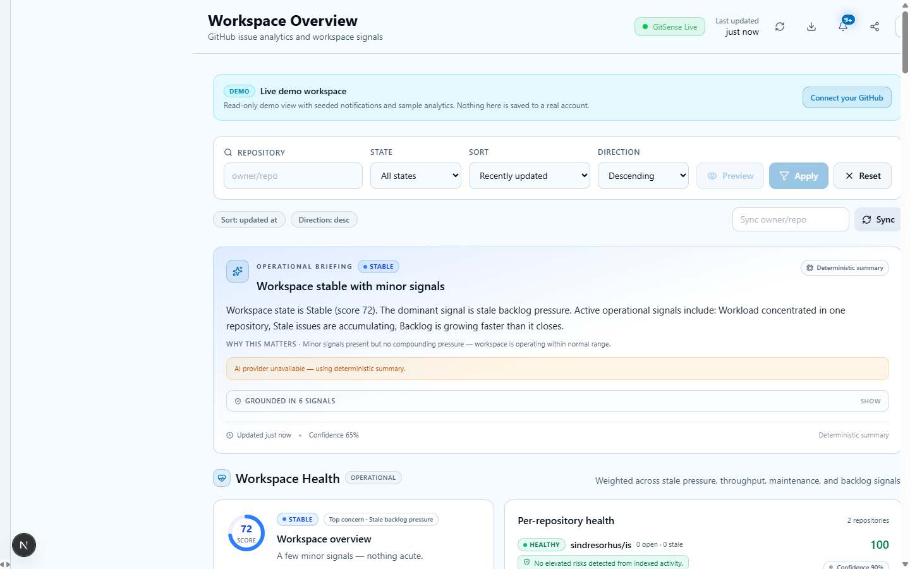
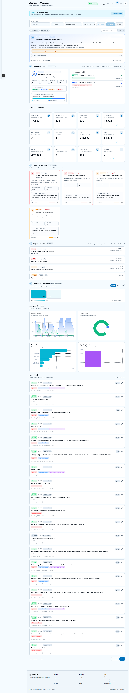
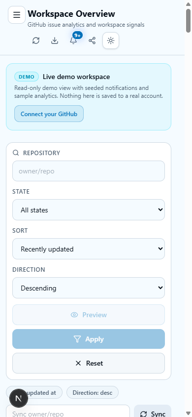
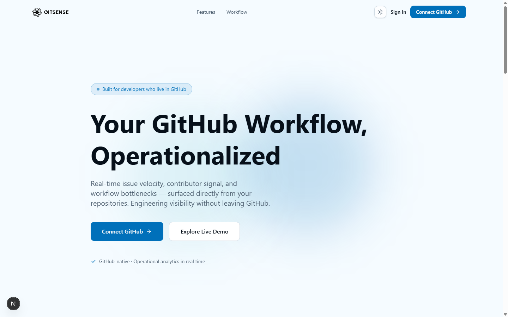
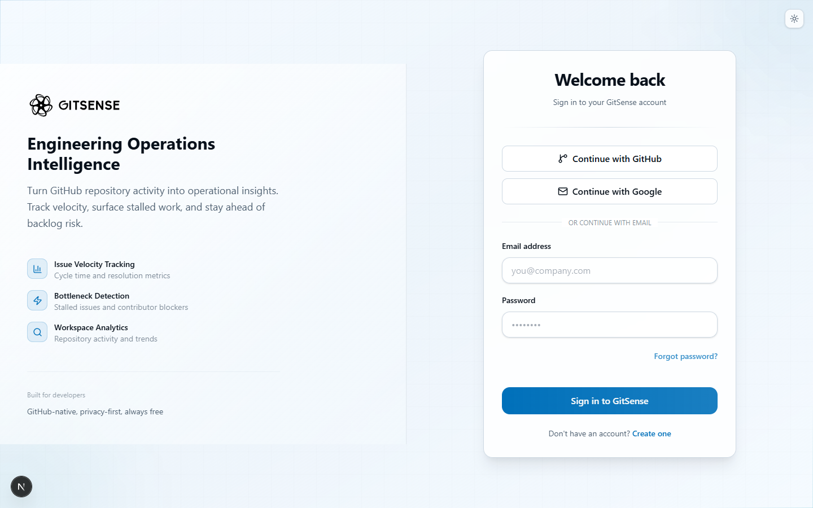
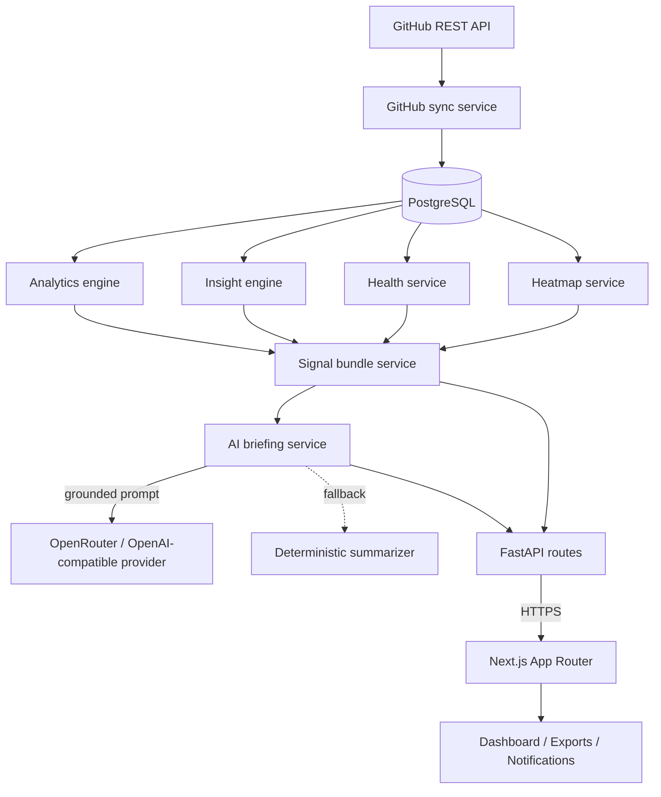
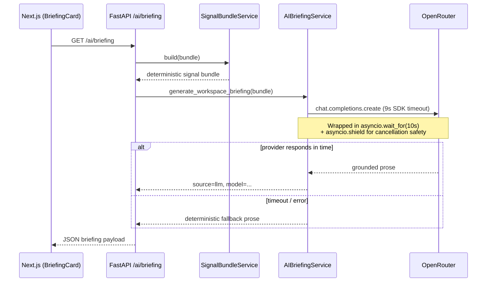

<div align="center">


# GitSense

### Engineering intelligence for GitHub workspaces.

Operational analytics over real GitHub repository data — backlog pressure,
stale signals, contributor concentration, throughput trends, and grounded
workspace briefings. Built for engineers, not dashboards.

</div>

---

## What GitSense is

GitSense reads the repositories you sync and produces a small set of
**grounded operational signals** that describe the health of your
workspace right now:

- where backlog pressure is concentrating
- which issues have gone quiet
- how contributor load is distributed
- how throughput is trending
- which signals are recurring across cycles

A short AI briefing interprets those deterministic signals into 3–5
sentences of restrained, engineering-focused prose. **The AI does not
invent metrics.** Every number on screen, and every signal cited in
the briefing, traces back to data the deterministic engine actually
computed from your repository.

If the AI provider is unavailable, GitSense falls back to a
deterministic summarizer so the dashboard always renders.

---

## Screenshots

### Dashboard — desktop

The dashboard leads with the operational briefing, then layers health,
metrics, insights, timeline, heatmap, and the issues feed underneath.



### Dashboard — full view

The full layout shows how signals are sequenced: briefing → health →
metrics → insights → timeline → heatmap → charts → issues.



### Dashboard — mobile

Mobile stacks the same hierarchy vertically with comfortable touch
targets and no clipping.

<p>
  
</p>

### Landing page



### Authentication



---

## Key capabilities

| Capability                          | Source                                                                                  |
| ----------------------------------- | --------------------------------------------------------------------------------------- |
| **Operational briefing**            | Deterministic signal bundle, interpreted by a grounded LLM (or deterministic fallback). |
| **Workspace health score**          | Weighted, explainable, per-repository + workspace-level.                                |
| **Backlog & stale-issue pressure**  | Issue age distribution, 14-day idle threshold, per-repo and per-workspace.              |
| **Throughput trend**                | Open vs closed velocity across a configurable window.                                   |
| **Contributor concentration**       | Activity share by contributor across synced repositories.                               |
| **Insight history**                 | Severity-trend tracking (improving / worsening / unchanged) across cycles.              |
| **Activity heatmap**                | Repository-level activity / stale / load intensities.                                   |
| **Export (CSV / JSON / Markdown)**  | Sanitized, formula-injection-safe; Markdown export is executive-ready.                  |
| **Notifications**                   | Operational events (sync completed, stale warnings, AI insight generated, ...).         |
| **Guest workspaces**                | Read-only demo sessions with strict per-session repository limits.                      |
| **GitHub / Google OAuth + email**   | Persistent workspaces are owned by authenticated users.                                 |

---

## Architecture



### Request lifecycle (briefing)



---

## AI philosophy

GitSense treats the LLM as an **interpretation layer**, never as a
data source. The contract:

1. **Grounding.** The system prompt and the user prompt both contain
   the deterministic signal bundle as JSON. The LLM is instructed
   to reference only signals present in that bundle.
2. **No fabrication.** The prompt forbids inventing metrics,
   percentages, dates, repositories, or causes. Language is
   restricted to observational engineering tone (`persisting`,
   `concentrated in`, `has not improved`).
3. **Bounded length.** 3–5 sentences. No lists, headers, emojis,
   marketing language, or rhetorical questions.
4. **Provider isolation.** Every call is wrapped in a hard
   `asyncio.wait_for(10s)` boundary on top of a 9s SDK timeout,
   shielded via `asyncio.shield`, with bounded cancellation drain.
5. **Graceful degradation.** Any error, timeout, or empty workspace
   short-circuits to a deterministic summarizer. The dashboard
   never blocks waiting on an LLM.
6. **Cache.** A 90-second process-local cache prevents repeat
   provider calls during dashboard re-renders.

The result: even if OpenRouter rate-limits or stalls, the
dashboard renders an honest operational summary in a few
milliseconds.

---

## Tech stack

**Frontend**

| Layer        | Choice                                |
| ------------ | ------------------------------------- |
| Framework    | Next.js 16 (App Router)               |
| Language     | TypeScript                            |
| Styling      | Tailwind CSS 4                        |
| Icons        | lucide-react                          |
| Charts       | recharts                              |
| Analytics    | `@vercel/analytics` (production only) |

**Backend**

| Layer        | Choice                                |
| ------------ | ------------------------------------- |
| Framework    | FastAPI                               |
| ORM          | SQLAlchemy (async)                    |
| HTTP client  | httpx (AsyncClient, timeouts)         |
| Database     | PostgreSQL                            |
| AI provider  | OpenAI SDK pointed at OpenRouter      |
| Auth         | Email + password, GitHub & Google OAuth |
| Email        | Resend (optional)                     |

**Deployment-ready**

- Frontend: Vercel (Next.js native)
- Backend: any container host (Render / Railway / Fly.io / Docker)
- Database: Supabase / Neon / managed Postgres

---

## Local development

### Backend

```bash
cd backend
python -m venv venv
. venv/Scripts/activate          # Windows
# source venv/bin/activate       # macOS / Linux
pip install -r requirements.txt
cp .env.example .env             # then fill the required keys
uvicorn app.main:app --reload
```

Backend listens on `http://localhost:8000`.
Health check: `GET /health` → `{"status":"healthy"}`.

### Frontend

```bash
cd frontend
npm install
echo "NEXT_PUBLIC_API_BASE_URL=http://localhost:8000" > .env.local
npm run dev
```

Frontend runs at `http://localhost:3000`.

### Validation

```bash
# Backend
python -m py_compile backend/app/main.py

# Frontend
cd frontend
npx tsc --noEmit
npx eslint .
npx next build
```

All four commands should exit with status 0 and zero warnings.

---

## Environment variables

The minimum required for local development is in
[`backend/.env.example`](backend/.env.example). Summary:

| Variable                       | Required | Purpose                                |
| ------------------------------ | -------- | -------------------------------------- |
| `DATABASE_URL`                 | ✅       | PostgreSQL connection string           |
| `JWT_SECRET_KEY`               | ✅       | Session signing                        |
| `GITHUB_CLIENT_ID` / `_SECRET` | ⚠️       | GitHub OAuth (sign-in)                 |
| `GITHUB_TOKEN`                 | ⚠️       | Higher GitHub API rate limit           |
| `GOOGLE_CLIENT_ID` / `_SECRET` | optional | Google OAuth                           |
| `RESEND_API_KEY`               | optional | Verification + password reset emails   |
| `OPENROUTER_API_KEY`           | optional | LLM briefing (falls back when empty)   |
| `OPENROUTER_MODEL`             | optional | Defaults to `deepseek/deepseek-v4-flash:free` |

Frontend reads `NEXT_PUBLIC_API_BASE_URL` and the optional
`NEXT_PUBLIC_SITE_URL` (used by `metadataBase` for absolute
OG / Twitter image URLs).

---

## Repository layout

```
GitSense/
├── AGENTS.md                  # Global engineering rules
├── README.md                  # This file
├── docs/
│   ├── DEPLOYMENT.md          # Deployment recipe
│   └── screenshots/           # Real screenshots used in README
├── .github/
│   ├── ISSUE_TEMPLATE/        # Bug + feature request templates
│   └── PULL_REQUEST_TEMPLATE.md
├── CONTRIBUTING.md
├── backend/
│   ├── AGENTS.md              # Backend rules
│   ├── .env.example
│   ├── requirements.txt
│   └── app/
│       ├── api/               # Route handlers (thin)
│       ├── services/          # Business logic
│       │   ├── ai_briefing_service.py
│       │   ├── analytics_service.py
│       │   ├── insight_engine.py
│       │   ├── health_service.py
│       │   ├── heatmap_service.py
│       │   ├── signal_bundle_service.py
│       │   └── ... (auth, github, ownership, ...)
│       ├── models/            # SQLAlchemy models
│       ├── schemas/           # Pydantic schemas
│       ├── database/          # DB setup / session
│       ├── utils/             # Shared helpers
│       └── main.py
└── frontend/
    ├── AGENTS.md              # Frontend rules
    ├── package.json
    ├── public/                # Branding assets (symbol.svg, ...)
    └── src/
        ├── app/               # App Router routes
        ├── components/        # UI components
        ├── hooks/
        └── lib/               # API helpers, sanitization
```

---

## Operational philosophy

- **Deterministic first, AI second.** Every signal is computable
  without the LLM. AI is presentation, not analysis.
- **Bounded everything.** Provider calls have hard timeouts.
  Caches have TTLs. Inputs are pagination-bounded.
- **No fake live streaming.** No fabricated metrics, no synthetic
  contributor counts, no animated noise.
- **Ownership-scoped data.** Authenticated workspaces are
  persistent and isolated. Guest sessions are temporary with
  strict limits.
- **Honest empty states.** When there is nothing to say, GitSense
  says so — it does not pad output to look busy.
- **Sanitized exports.** CSV cells are formula-injection-safe;
  Markdown exports escape user-controlled strings.

---

## Roadmap (non-binding)

- Shared cross-worker briefing cache (Redis) for multi-instance
  deployments.
- Server-side PDF export (currently disabled in the export panel).
- Per-team workspaces with role-based access.
- Configurable insight thresholds (currently hard-coded sensible
  defaults).
- Browser extension integration for in-context GitHub overlays.

---

## License

Internal / unreleased. Not currently licensed for redistribution.
